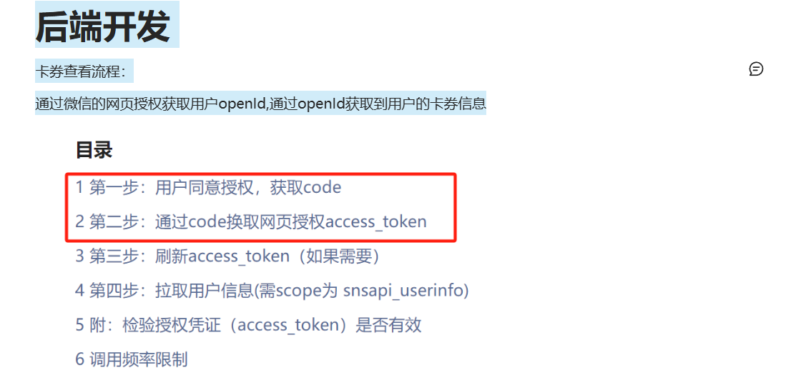

接口文档
更新用户信息
允许已授权的用户通过此接口更新自己的信息。
URL：/api/mycoupon
Method：GET
需要登录：
是
需要鉴权：
是
请求参数
参数
类型
约束
code
String
1 到 30 个字符 用来获取用户openId
💡 注意，id 和 email 字段目前是只读属性，不允许通过此接口进行修改。
请求示例
可以仅传递部分请求参数。
JSON
复制代码
1
2
3
{
    "code": "codedemo"
}
成功响应
条件：请求参数合法，并且用户身份校验通过。
状态码：200 OK
响应示例：响应会将修改后的用户信息数据返回，一个id为 1234 的用户设置他们的姓名后将会返回：
响应
JSON
复制代码
错误响应
条件：请求数据非法，例如未填写必须参数。
状态码：500 BAD REQUEST

后端开发
卡券查看流程：
通过微信的网页授权获取用户openId,通过openId获取到用户的卡券信息
构造前端页面
REDIRECT_URI=https://11ir9803988vm.vicp.fun/coupon.html
https://open.weixin.qq.com/connect/oauth2/authorize?appid=wx495d95f6dc137db2&redirect_uri=https%3A%2F%2F11ir9803988vm.vicp.fun%2Fcoupon.html&response_type=code&scope=snsapi_base&state=state&connect_redirect=1#wechat_redirect
通过code获取open Id
通过openId查看userId
通过userId获取卡券信息
CouponResp
Java
运行代码
复制代码
16
17
18
19
20
21
22
23
24
25
26
27
28
29
30
31
32
33
34
35
36
37
38
39
40
41
42
43
44
45
46
47
48
49
50
51
52
53
54
55
56
57
58
59
60
61
62
63
64
65
66
67
68
69
70
71
72
73
74
75
76
77
78
79
80
81
82
83
84
85
86
87
88
89
90
91
import lombok.Builder;
    /**
     * 卡券ID
     */
    private String couponId;

    /**
     * 卡券代码，唯一标识卡券的代码
     */
    private String couponCode;

    /**
     * 卡券类型，与卡券类型表相关联
     */
    private String couponType;

    /**
     * 卡券面值，可能是折扣金额或批改次数
     */
    private BigDecimal couponValue;

    /**
     * 卡券有效期
     */
    private LocalDate expirationDate;

    /**
     * 卡券状态，如未使用、已使用、过期
     */
    private String couponStatus;

    /**
     * 用户ID，与用户表关联
     */
    private String userId;

    /**
     * 数据创建时间
     */
    private LocalDateTime createdAt;

    /**
     * 数据最后修改时间
     */
    private LocalDateTime updatedAt;

    /**
     * 创建人ID
     */
    private Long createdBy;

    /**
     * 最后修改人ID
     */
    private Long updatedBy;

    /**
     * 类型ID
     */
    private String typeId;

    /**
     * 类型名称，描述卡券类型
     */
    private String typeName;

    /**
     * 类型描述，详细说明卡券类型的信息
     */
    private String typeDescription;

    /**
     * 类型属性，可包括卡券类型的相关属性
     */
    private String typeProperties;

}

前端开发及联调
页面代码
REDIRECT_URI?code=XXX
https://11ir9803988vm.vicp.fun/coupon.html?code=XXX
前端流程：
获取url中的code
将code作为参数传给服务端
coupon.html
HTML
运行代码
复制代码
94
95
96
97
98
99
100
101
102
103
104
105
106
107
108
109
110
111
112
113
114
115
116
117
118
119
120
121
122
123
124
125
126
127
128
129
130
131
132
133
134
135
136
137
138
139
140
141
142
143
144
145
146
147
148
149
150
151
152
153
154
155
156
157
158
159
160
161
162
163
164
165
166
167
168
169
170
171
<!DOCTYPE html>
            coupons.forEach(function (coupon) {
                var cell = document.createElement('div');
                cell.classList.add('custom-coupon');

                // 创建卡券信息显示
                var couponInfo = document.createElement('p');
                var chineseStatus = statusMapping[coupon.couponStatus] || coupon.couponStatus;

                // 格式化显示信息
                var displayInfo = [
                    "类型: " + coupon.typeName,
                    "面值: " + coupon.couponValue + "次批改",
                    "有效期: " + coupon.expirationDate,
                    "状态: " + chineseStatus
                ].join(", ");

                couponInfo.textContent = displayInfo;
                cell.appendChild(couponInfo);

                // 只有未使用的卡券才显示兑换按钮
                if (coupon.couponStatus === "UNUSED") {
                    var exchangeButton = document.createElement('button');
                    exchangeButton.textContent = "兑换";
                    exchangeButton.addEventListener('click', function () {
                        if (confirm("确定要兑换这张卡券吗？")) {
                            exchangeButton.disabled = true;
                            exchangeButton.textContent = "兑换中...";

                            fetch('https://11ir9803988vm.vicp.fun/api/exchange', {
                                method: 'POST',
                                headers: {
                                    'Content-Type': 'application/json'
                                },
                                body: JSON.stringify({
                                    couponCode: coupon.couponCode,
                                    userId: coupon.userId
                                })
                            })
                                .then(function (response) {
                                    return response.json();
                                })
                                .then(function (result) {
                                    if (result.code === 200) {
                                        coupon.couponStatus = "USED";
                                        exchangeButton.textContent = "已兑换";
                                        exchangeButton.disabled = true;
                                        alert("卡券兑换成功！");
                                        // 刷新页面显示最新状态
                                        location.reload();
                                    } else {
                                        exchangeButton.disabled = false;
                                        exchangeButton.textContent = "兑换";
                                        alert(result.message || "兑换失败，请重试");
                                    }
                                })
                                .catch(function (error) {
                                    console.error('Error:', error);
                                    exchangeButton.disabled = false;
                                    exchangeButton.textContent = "兑换";
                                    alert("兑换失败，请重试");
                                });
                        }
                    });
                    cell.appendChild(exchangeButton);
                }

                couponList.appendChild(cell);
            });
        })
        .catch(function (error) {
            console.error('Error:', error);
            document.getElementById('couponList').innerHTML =
                '
加载失败，请刷新重试
';
        });
</script>
</body>
</html>
